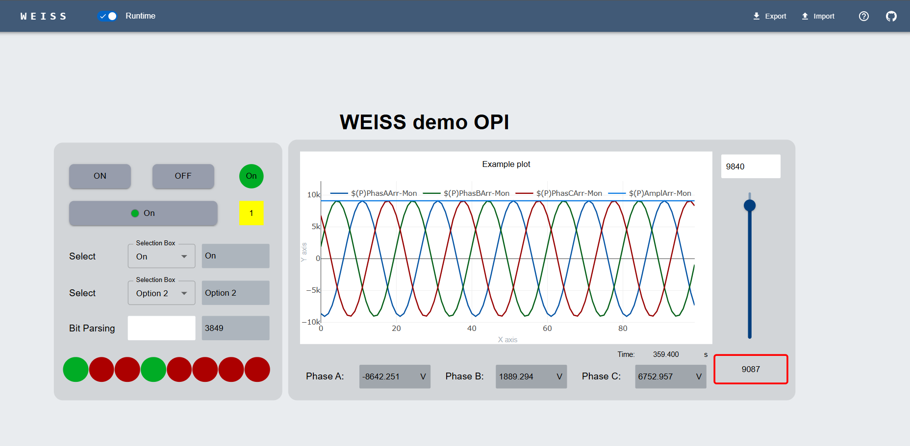

# WEISS – Web EPICS Interface & Synoptic Studio

WEISS is a no-code, drag-and-drop system for building web-based EPICS operation interfaces. It
provides a responsive editor, live PV communication, and a lightweight deployment model.

> If you are in a hurry: [Quick Start](#quick-start).

Try it out: https://demo.weiss-controls.org.



The demo connects to a real IOC. For the demo, all edits stay in your browser only. Use **Load
Demo** anytime to restore.

## Why should you use web?

- **Client-side rendering**: the client browser performs most work; backend load stays minimal.
- **Ease of access**: use any modern browser—no remote desktops or local tools required. Access
  control relies on standard security mechanisms (network restrictions, authentication, reverse
  proxies, etc).
- **Built for scale**: concurrent users do not require dedicated VMs or graphical sessions.
- **Global ecosystem**: web technologies have one of the largest developer ecosystems, offering
  libraries, tools, and best practices beyond the scientific environment niche.
- **Integration friendly**: easy to connect with authentication systems (LDAP), GitHub/GitLab, and
  other modern tools.

---

## Key Features

- **Drag-and-drop editor** with grid snapping, alignment, grouping, layering, keyboard shortcuts.
- **Live EPICS PV communication**: supports both Channel Access (CA) and PV Access (PVA) protocols
  via community-validated implementations [p4p](https://github.com/epics-base/p4p/) and
  [PyEpics](https://pyepics.github.io/pyepics/).
- **Runtime vs edit mode**: instantly start and stop communication with a switch button.
- **Extensible widget library**: ready-to-use components for common controls and displays, others
  can be easily created.
- **Designed for usability** : responsive UI, straightforward layout logic, modern development
  stack.
- **Portable JSON format**: import/export or create OPIs programatically using simple JSON files.

Planned improvements (access control, OPI distribution, repository integration, etc.) are tracked in
the [WEISS Project Dashboard](https://github.com/orgs/weiss-controls/projects/1/).

## Quick start

1. Install Docker

Instructions: https://docs.docker.com/engine/install/.  
Tested with Docker Engine 28.1.1, but other versions should work.

> Tested with Docker Engine from 28.1.1, but most versions are expected to work fine.

2. Clone the repository:

```sh
git clone https://github.com/weiss-controls/weiss.git
```

3. Create your `.env` file: You can start by just copying [.env.example](./.env.example):

```sh
cp .env.example .env
```

> The whole behaviour of the app is configured via environment variables. The easiest way to
> validate your build is to start with `VITE_DEMO_MODE=true`. This allows you to spin up an instance
> of [WEISS Demo](https://demo.weiss-controls.org) locally and quickly explore the tool.
> Instructions on setting up HTTPS, Microsoft Auth and Git credentials coming soon.

Adjust EPICS variables as needed (`DEFAULT_PROTOCOL`, `EPICS_XXX_ADDR_LIST`, etc.) so WEISS can find
your PVs. If running on a server (not localhost), make sure to modify `FRONTEND_URL` with your
server's IP address or DNS name - this allows .

4. Build and start the system. From the root of the repo, run:

```sh
docker compose up -d
```

Once built, three services should be launched:

- `weiss-epicsws`: the EPICS communication layer.
- `weiss-api`: the backend API for file and git interaction.
- `weiss`: WEISS front-end application - accessible at http://localhost (or your server address if
  applicable).

> :bulb: **_TIP:_** if you do not have an IOC available for testing, try running the development
> demo IOC: `docker compose -f docker-compose-dev.yml up -d weiss-demoioc`. This will build and run
> the IOC from [examples](./examples/). The corresponding OPIs can be imported from
> [weiss-demo-opis](https://github.com/weiss-controls/weiss-demo-opis) using WEISS file browser.

### Development

The development version mounts the source code so you can see live changes while coding. It also
provides a demoioc for convenience.

Run:

```sh
docker compose -f docker-compose-dev.yml up
```

This launches four services:

- `weiss-epicsws-dev`: the EPICS communication layer.
- `weiss-api-dev`: the backend API for file and git interaction.
- `weiss-dev`: The WEISS front-end application. It should be accessible in `http://localhost:5173`.
- `weiss-demoioc`: EPICS demonstration IOC (see [examples/exampleIOC](examples/exampleIOC)).

> For the API, the service should be restarted for endpoint changes to take effect. Remind to set
> `FRONTEND_URL` to `http://localhost:5173`.

## Notes

- Built with React + TypeScript
- UI components are based on Material UI: https://mui.com/material-ui/
- Some references used for this project: [Taranta](https://gitlab.com/tango-controls/web/taranta),
  [React Automation Studio](https://github.com/React-Automation-Studio/React-Automation-Studio),
  [PVWS](https://github.com/ornl-epics/pvws), [pyDM](https://github.com/slaclab/pydm),
  [Phoebus](https://github.com/ControlSystemStudio/phoebus).
